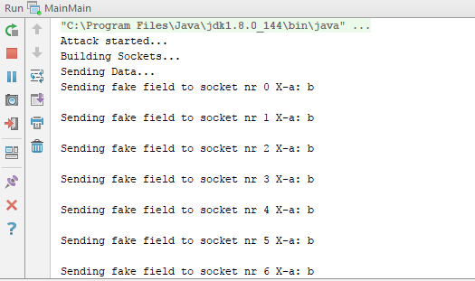
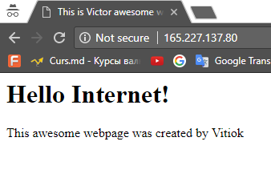

### Intro
In this laboratory work, my main task was to simulate a type of attack. I have chosen to do a SLOWLORRIS attack, as I've found lots of information online. <br />

According to wikipedia, ```slowlorris``` is a type of denial of service attack tool. It does is it tries to keep many connections to the target web server open and hold them open as long as possible. It accomplishes this by opening connections to the target web server and sending a partial request. Periodically, it will send subsequent HTTP headers, adding to—but never completing—the request. <br />

### Work procedure
##### Tools and technologies used
Language - Java <br />
Build and Dependency Mngmt - Maven <br />
VCS - Git <br />
Cloud for Server - DigitalOcean

##### Implementation: 
In order to successfully perform this laboratory work I've been working in team with @lucavictor220 . He has created a digitalocean droplet(server) and an apache based web page, which was basically our eperiment rat.

What I do is:

```
1. create an array of sockets
2. initialize each of the sockets in array
3. send partial request to each socket
4. keep the connection alive
5. send fake header fields with a timeout
6. repeat 
```


##### Verification 
As dumb as it might sound, the way I use to test my work is by accessing the hacked page in browser. Voila!

Before:


After:


